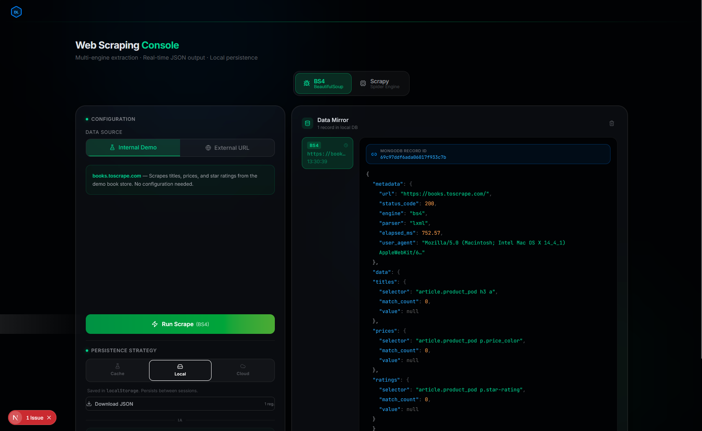
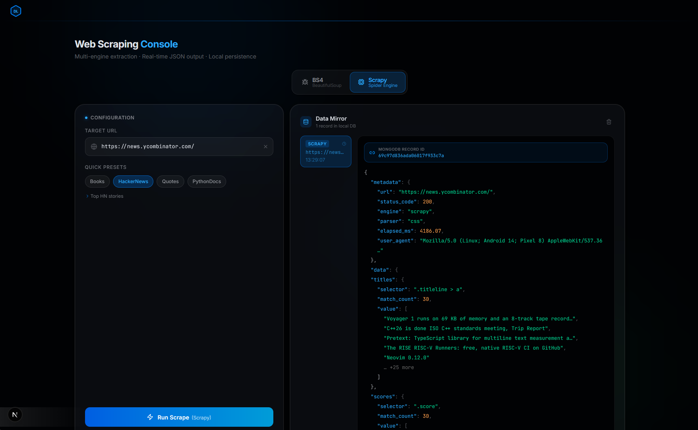
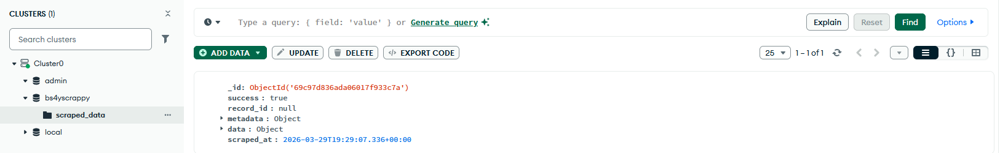

<div align="center">

# DataLab - Advanced Web Scraping Engine


*A high-performance, modular web scraping dashboard engineered for scalable data extraction, responsive process management, and automated cloud persistence.*

</div>

## Overview

**DataLab** is a modern, full-stack application designed to orchestrate complex web scraping workloads. It features a sophisticated dual-engine backend capable of intelligently routing tasks between lightweight HTML parsers and robust crawling frameworks. 

This project was built to demonstrate full-stack proficiency, particularly in handling asynchronous Python workloads, mitigating memory leaks in concurrent environments, and designing cloud-native database architectures.

---

## Interface Preview

> **Multi-engine extraction dashboard with real-time JSON output and Cloud persistence.**


---

## 🏗️ Architecture

The application is structured around a decoupled, microservice-inspired architecture:

<div align="center">
  
</div>

### 1. Frontend layer (Next.js & Tailwind CSS)
- **Responsive & Modern UI**: A minimalist, glassmorphic interface built on Next.js 16.2.
- **Dynamic Control Panel**: Features segmented controls for real-time engine toggling (Scrapy vs BS4).
- **Live Data Mirror**: Implements Framer Motion to animate state transitions and visualize scraped JSON payloads as they arrive.

### 2. Backend Orchestration (FastAPI)
- **Asynchronous API**: Leverages FastAPI to handle concurrent REST requests without blocking.
- **Dual Extraction Engine**:
  - **BeautifulSoup (BS4) Engine**: Utilized for synchronous, lightweight, on-the-fly DOM parsing tasks where speed and low overhead are critical.
  - **Scrapy Engine**: Deployed for heavy-duty, recursive, and massive data extraction workflows requiring concurrency, advanced rate-limiting, and middleware support.

### 3. Cloud Data Persistence (MongoDB Atlas)
- **Document Store**: Stores semi-structured scraping results resiliently in the cloud.
- **Data Lifecycle Management**: Architected to be self-maintaining using MongoDB native indexing tools.

## 🔍 Data Integrity & Cloud Verification

To ensure end-to-end consistency, the system captures the unique `ObjectId` generated by MongoDB Atlas upon successful persistence and displays it in the UI. This verifies that the data displayed in the "Data Mirror" is exactly what was stored in the cloud without data loss.

| **Frontend Console (UI)** | **MongoDB Atlas Dashboard** |
| :--- | :--- |
|  |  |
| **ID:** `69c97d836ada06017f933c7a` | **ID:** `ObjectId('69c97d836ada06017f933c7a')` |

<details>
<summary><b>📄 Click to view the generated JSON Payload Structure</b></summary>

```json
{
  "success": true,
  "record_id": "69c97ddf6ada06017f933c7b",
  "metadata": {
    "url": "[https://books.toscrape.com/](https://books.toscrape.com/)",
    "status_code": 200,
    "engine": "bs4",
    "parser": "lxml",
    "elapsed_ms": 752.57
  },
  "data": {
    "titles": {
      "selector": "article.product_pod h3 a",
      "match_count": 0
    }
  }
}
```
</details>

## ⚡ Technical Challenges & Solutions

### 1. The `ReactorNotRestartable` Concurrency Block
**The Challenge:** 
Integrating Scrapy—which relies heavily on the Twisted event loop (Reactor)—into an asynchronous container like FastAPI causes severe architectural friction. The Twisted Reactor is designed to run only once per thread. Attempting to trigger multiple Scrapy jobs across continuous HTTP requests predictably throws a `ReactorNotRestartable` exception, crashing the application.

**The Solution:**
Instead of fighting the Event Loop, I implemented **Process Isolation leveraging the `multiprocessing` module**. 
- Whenever a Scrapy task is requested, FastAPI spawns a completely isolated OS-level process. 
- The Twisted Reactor initializes, executes the crawl, and cleanly tears down inside this isolated boundary without ever knowing about the parent event loop.
- To retrieve the data, I implemented **asynchronous IPC (Inter-Process Communication) queues**, allowing the isolated worker to reliably pipe the extracted JSON payload back to the async FastAPI thread for HTTP delivery.

```python
# Conceptual Implementation
from multiprocessing import Process, Queue

def run_spider(queue, url):
    # Initializes its own independent Reactor
    process_results = execute_scrapy_engine(url) 
    queue.put(process_results)

# API Route Handler
queue = Queue()
worker = Process(target=run_spider, args=(queue, target_url))
worker.start()
worker.join() # Awaited asynchronously 
```

### 2. Cloud Engineering: Ephemeral Data Architectures
**The Challenge:** 
Large scale scraping generates vast amounts of unstructured JSON, which can quickly inflate cloud database costs and cause performance degradation if data is kept indefinitely without a strategy.

**The Solution:**
I engineered a self-pruning architecture on **MongoDB Atlas** by implementing **TTL (Time-To-Live) Indexes**. 
Documents are stamped with a server-side creation timestamp upon insertion. A background thread on the database cluster automatically purges records exactly 24 hours after extraction. This ensures that the application maintains a lean, hyper-performant database footprint tailored purely for caching and recent data retrieval, eliminating manual database ops and optimizing cloud spending.

---

## 🚀 Getting Started

### Prerequisites
- Python 3.10+
- Node.js 18+
- A MongoDB Atlas Cluster URI

### Backend Setup
```bash
cd BackEnd
python -m venv .venv
# On Windows:
.\.venv\Scripts\activate
# On macOS/Linux:
# source .venv/bin/activate

pip install -r requirements.txt

# Set up your env variables (.env file in BackEnd folder)
echo "MONGO_URI=mongodb+srv://<user>:<password>@cluster.mongodb.net/" > .env

python -m uvicorn app.main:app --reload
```

### Frontend Setup
```bash
cd FrontEnd
npm install
npm run dev
```

The Dashboard will be accessible at `http://localhost:3000`.

## ⚖️ Ethical Scraping & Robustness

### Responsible Data Extraction
DataLab is engineered to be a "Good Bot". It implements:
- **Rate Limiting**: Integrated delays to avoid overwhelming target servers (Politeness Policy).
- **User-Agent Rotation**: Mimics legitimate browser behavior to reduce 403/429 errors.

### Error Handling & Resilience
The BeautifulSoup engine features **Defensive Selection**. Instead of direct DOM mapping, it uses conditional checks to prevent crashes when website structures change (schema drift), ensuring the API always returns valid JSON even if elements are missing.
---
<div align="center">

 *Developed by [NUINUI]*

</div>
